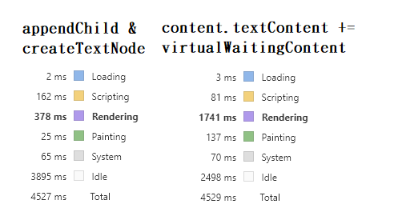

# 文字檔案串流

##### 版本 1.2.0

-   加入 Web Worker(workerSplitStrToChunk.js), 將原先主程序 處理 切割資料的部分, 移至 Worker 處理
-   並修改 loadChunkTextFile() 回傳資料格式, 從 buffer 解析後的資料, 若切割一次產生多個 chunk, 將 chunk 打包成 chunks 一次傳送, 減少 Scripting 時間

> 版本首位 修改做法時
> 版本中位 相同做法, 修改流程
> 版本末位 修改 BUG

### 使用到的 WebAPI

#### 串流部分

-   Web Worker
-   fetch
-   ReadableStream
-   TextDecoder

---

---

## 串流流程介紹

#### Step1 : 透過 Web Worker 進行 檔案下載 與 解碼

    使用 workerLoadAndDecode.js 將下載 與 解碼, 交由其他執行緒, 等待資料回傳

=============

#### Step2 : 使用 Fetch 取得 流資料

    在 Web Worker 中, 透過 fetch : 回傳 Response 取得 流資料(Response.body 為 ReadableStream)

=============

#### Step3 : 使用 ReadableStream 處理 流資料

    ReadableStream.getReader() 取得 ReadableStreamDefaultReader,
    ReadableStreamDefaultReader 透過 await read(), 當 buffer 滿時,
    回傳 { done : boolean, value : Uint8Array }

=

> 當 done === true 時, typeof value === undefined

=============

#### Step4 : decode Uint8Array 使用 TextDecoder

    new TextDecoder.decode(ArrayBufferView, options)
    ArrayBufferView types 包含 Uint8Array
    options : object { stream : boolean }
    options.stream : 當 chunk 中, 設定 true,
    可避免文字, 因 chunk 截斷, 解碼 剩餘位元 導致亂碼
    剩餘位元, 會保留在 TextDecoder 中,
    等下個 chunk 要 decode 時, 將合併 剩餘位元

=

> TextDecoder.decode() 直接使用, 將會把 剩餘位元 輸出

---

---

## 其他

#### testfiles

    提供測試檔案
        dataExtraLarge.txt  1.07 GB
        dataLarge.txt       100  MB
        dataMid.txt         1.45 MB
        dataSmall.txt       212  KB

=============

#### loadChunkTextFile.js

    提供 loadChunkTextFile(path, cb, chunkSize);
    path(requirement): 檔案 URL,
    cb(requirement): Callback Function, 當取得一定長度的資料時, 回傳資料給 cb,
        回傳資料格式: obj {
                            chunks: chunkString[],
                            done: Is done? ,
                            error: errorMessage.length > 0,
                            errorMessage,
                         }
    chunkSize(default: 1024) 切分的檔案大小,  此大小為解碼後(data.String.length)切分的大小

=============

#### workerLoadAndDecode.js

    處理 下載並回傳解碼

=============

#### loadChunkTextFile.js

    處理解碼後 資料切分為指定大小資料塊

=============

#### index.html

    展示 與 測試 loadChunkTextFile()
    目前載入 dataLarge.txt, 提供兩種 Render 測試,
        Test1 : 採用 textContent 加入 文字;
        Test2 : 採用 createTextNode 透過 appendChild 加入;

        * Rendering 時間, Test2 低於 Test1
        * Scripting 時間, Test1 低於 Test2
        * 整體 Test2 運行時間 低於 Test1

